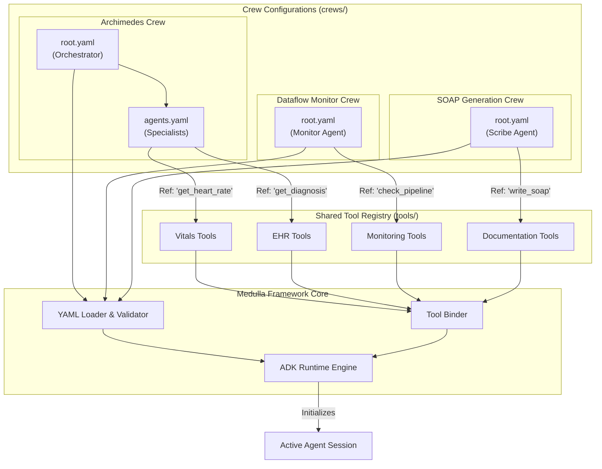

# Agentic Framework Architecture

This document outlines the architecture for the unified agentic framework using Google's Agent Development Kit (ADK) with a YAML-first approach.

## Architecture Flowchart

The following diagram illustrates how the unified Medulla Framework orchestrates different crews (Archimedes, Dataflow Monitor, SOAP Crew) using a shared Tool Registry and a common ADK Runtime.



## Expanded Directory Structure

The structure allows for infinite scalability of crews while keeping the tool implementation centralized and DRY (Don't Repeat Yourself).

```text
medulla/
├── crews/                          # CREW DEFINITIONS (YAML ONLY)
│   ├── archimedes/
│   │   ├── root.yaml               # Main entry: Defines the Orchestrator
│   │   └── agents.yaml             # Sub-agents: Cardiology, Sleep, Pulmonary, etc.
│   │
│   ├── ask_alyf/
│   │   └── root.yaml               # Single agent or simple crew for Q&A
│   │
│   ├── dataflow_monitor/           # Distinct Crew: Monitors System Health
│   │   └── root.yaml
│   │
│   └── soap_crew/                  # Distinct Crew: Generates Clinical Notes
│       └── root.yaml
│
├── tools/                          # SHARED TOOL IMPLEMENTATIONS (PYTHON)
│   ├── __init__.py
│   ├── registry.py                 # Registry mapping string names to functions
│   ├── vitals/
│   │   ├── __init__.py
│   │   └── getters.py              # e.g., get_member_vitals_data
│   ├── clinical/
│   │   ├── __init__.py
│   │   └── events.py               # e.g., get_clinical_events
│   ├── monitoring/
│   │   └── pipeline_checks.py      # e.g., check_dataflow_status
│   └── documentation/
│       └── soap_generators.py      # e.g., generate_soap_section
│
└── framework/                      # CORE INFRASTRUCTURE
    ├── loader.py                   # Parsing logic for root.yaml and agents.yaml
    ├── binder.py                   # Binds Python functions to ADK Tool objects
    └── runner.py                   # Main execution entry point
```

## Configuration Types & Schema Details

The framework relies on two primary configuration file types: `root.yaml` and `agents.yaml`.

### 1. Root Configuration (`root.yaml`)
Defines the entry point for a crew. It specifies the high-level architecture (e.g., single agent vs. hierarchical orchestrator).

**Schema:**
*   `name` (string): Unique identifier for the crew (e.g., "archimedes_v2").
*   `type` (enum): The architectural pattern.
    *   `orchestrator`: A supervisor manages sub-agents.
    *   `router`: Routes queries to specific sub-agents without supervision.
    *   `single`: A standalone agent.
*   `supervisor` (object, optional): Defines the managing agent (if type is `orchestrator`).
    *   `model`: The LLM model ID (e.g., `gemini-1.5-pro`).
    *   `instruction`: High-level system prompt for coordination.
*   `sub_agents` (list): List of references to agents defined in `agents.yaml`.

**Example:**
```yaml
name: "archimedes_crew"
type: "orchestrator"
supervisor:
  model: "gemini-1.5-pro"
  instruction: "You are the Chief Medical Officer. Delegate patient queries to the appropriate specialist."
sub_agents:
  - $ref: "./agents.yaml#/cardiology_agent"
  - $ref: "./agents.yaml#/sleep_agent"
```

### 2. Agent Definitions (`agents.yaml`)
Defines the reusable worker agents. These can be referenced by multiple crews if needed.

**Schema:**
*   `[agent_key]` (object): The unique key for the agent (e.g., `cardiology_agent`).
    *   `model` (string): The LLM model to use.
    *   `description` (string): Short description for the orchestrator to understand the agent's role.
    *   `instruction` (string): The detailed system prompt (persona).
    *   `tools` (list of strings): Exact names of tools from the `tools/` registry this agent can access.

**Example:**
```yaml
cardiology_agent:
  model: "gemini-1.5-pro"
  description: "Cardiology Specialist"
  instruction: |
    You are a cardiologist. Your goal is to analyze heart rate, BP, and ECG data.
    Always cite the timestamp of the vital sign in your analysis.
  tools:
    - "get_heart_rate_series"
    - "get_blood_pressure_latest"
    - "calculate_hrv_trends"

soap_scribe_agent:
  model: "gemini-1.5-flash"
  description: "Medical Scribe"
  instruction: "Convert the clinical conversation into a structured SOAP note."
  tools:
    - "format_soap_section"
```

