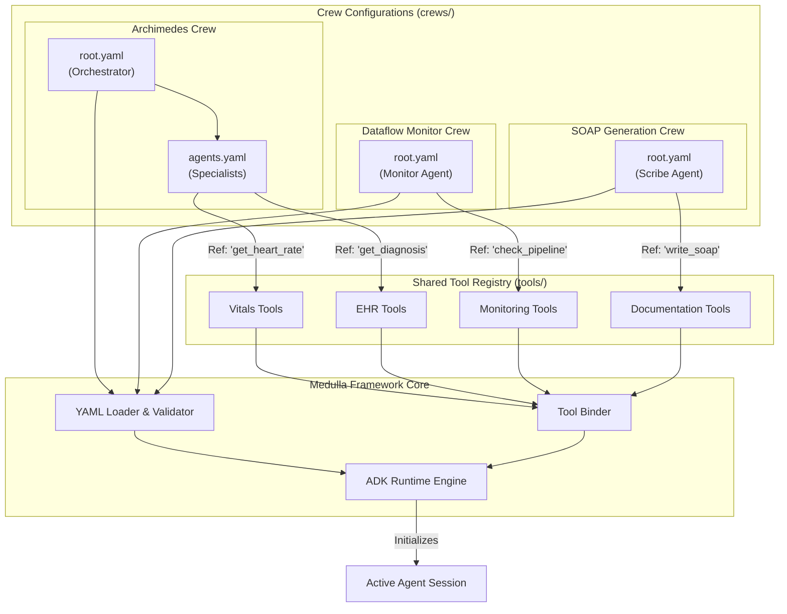

# Agentic Framework Architecture

This document outlines the architecture for the unified agentic framework using Google's Agent Development Kit (ADK) with a YAML-first approach.

## Key Principle: Leverage ADK Native Capabilities

**Important**: Google's ADK natively supports YAML-based agent definitions. This architecture leverages ADK's built-in capabilities rather than creating a custom abstraction layer. Our framework layer (`framework/`) serves only as:
- **Organization**: Structured crew and tool discovery
- **Registry**: Centralized tool catalog to prevent duplication
- **Convenience**: Simplified crew execution commands

The actual agent orchestration, tool binding, and execution are handled by ADK's native runtime.

## Architecture Flowchart

The following diagram illustrates how the unified Medulla Framework orchestrates different crews (Archimedes, Dataflow Monitor, SOAP Crew) using a shared Tool Registry and a common ADK Runtime.



## Expanded Directory Structure

The structure allows for infinite scalability of crews while keeping the tool implementation centralized and DRY (Don't Repeat Yourself).

```text
medulla/
├── crews/                          # CREW DEFINITIONS (YAML ONLY)
│   ├── archimedes/
│   │   ├── root.yaml               # Main entry: Defines the Orchestrator
│   │   └── agents.yaml             # Sub-agents: Cardiology, Sleep, Pulmonary, etc.
│   │
│   ├── ask_alyf/
│   │   └── root.yaml               # Single agent or simple crew for Q&A
│   │
│   ├── ros/                        # Distinct Crew: Connection Diagnosis
│   │   ├── root.yaml               # Main orchestrator for diagnosis
│   │   └── agents.yaml             # Diagnostic sub-agents
│   │
│   ├── dataflow_monitor/           # Distinct Crew: Connection diagnostic
│   │   └── root.yaml
│   │
│   └── soap_crew/                  # Distinct Crew: Generates Clinical Notes
│       └── root.yaml
│
├── tools/                          # SHARED TOOL IMPLEMENTATIONS (PYTHON)
│   ├── __init__.py
│   ├── registry.py                 # Registry mapping string names to functions
│   ├── vitals/
│   │   ├── __init__.py
│   │   └── getters.py              # e.g., get_member_vitals_data
│   ├── clinical/
│   │   ├── __init__.py
│   │   └── events.py               # e.g., get_clinical_events
│   ├── monitoring/
│   │   └── pipeline_checks.py      # e.g., check_dataflow_status
│   └── documentation/
│       └── soap_generators.py      # e.g., generate_soap_section
│
└── framework/                      # CORE INFRASTRUCTURE
    ├── loader.py                   # Parsing logic for root.yaml and agents.yaml
    ├── binder.py                   # Binds Python functions to ADK Tool objects
    └── runner.py                   # Main execution entry point
```

## Configuration Types & Schema Details

**Important**: The YAML configuration files follow Google ADK's official YAML syntax and structure. The framework's loader parses ADK-compliant YAML configurations to instantiate agents programmatically.

The framework uses two primary configuration file types: `root.yaml` and `agents.yaml`.

### 1. Root Configuration (`root.yaml`)
Defines the entry point for a crew following ADK's agent configuration format. For orchestrator crews, this defines the supervisor agent that coordinates sub-agents.

**ADK-Compliant Schema:**
*   `name` (string): Unique identifier for the crew/agent (e.g., "archimedes_crew").
*   `model` (string): The LLM model ID (e.g., `gemini-1.5-pro`).
*   `description` (string): Brief description of the crew's purpose.
*   `instruction` (string): System prompt for the orchestrator/supervisor.
*   `sub_agents` (list, optional): References to agent definitions in `agents.yaml`.
*   `tools` (list, optional): Tools available to the orchestrator.

**Example (Orchestrator Crew):**
```yaml
name: "archimedes_crew"
model: "gemini-1.5-pro"
description: "Multi-specialist clinical consultation orchestrator"
instruction: |
  You are the Chief Medical Officer. Delegate patient queries to the appropriate specialist.
  Coordinate responses from cardiology, sleep, and pulmonary specialists.
sub_agents:
  - $ref: "./agents.yaml#/cardiology_agent"
  - $ref: "./agents.yaml#/sleep_agent"
  - $ref: "./agents.yaml#/pulmonary_agent"
```

**Example (Single Agent Crew):**
```yaml
name: "dataflow_monitor"
model: "gemini-1.5-flash"
description: "System health monitoring agent"
instruction: |
  You monitor data pipeline health. Check for stuck jobs, latency issues, and system errors.
tools:
  - name: "check_pipeline_status"
  - name: "get_job_metrics"
```

### 2. Agent Definitions (`agents.yaml`)
Defines reusable worker agents following ADK's agent configuration syntax. Each agent entry follows ADK's standard format.

**ADK-Compliant Schema:**
*   `[agent_key]` (object): The unique key for the agent (e.g., `cardiology_agent`).
    *   `name` (string): Agent identifier (optional, defaults to key).
    *   `model` (string): The LLM model to use (e.g., `gemini-1.5-pro`).
    *   `description` (string): Short description of the agent's role.
    *   `instruction` (string): The detailed system prompt (persona).
    *   `tools` (list): List of tool references. Each tool can be:
        *   A string: Tool name from the registry (e.g., `"get_heart_rate"`).
        *   An object: `{ name: "tool_name" }` for ADK compatibility.

**Example:**
```yaml
cardiology_agent:
  name: "cardiology_specialist"
  model: "gemini-1.5-pro"
  description: "Cardiology Specialist"
  instruction: |
    You are a cardiologist. Your goal is to analyze heart rate, BP, and ECG data.
    Always cite the timestamp of the vital sign in your analysis.
  tools:
    - name: "get_heart_rate_series"
    - name: "get_blood_pressure_latest"
    - name: "calculate_hrv_trends"

soap_scribe_agent:
  name: "soap_scribe"
  model: "gemini-1.5-flash"
  description: "Medical Scribe"
  instruction: "Convert the clinical conversation into a structured SOAP note."
  tools:
    - name: "format_soap_section"
```

## Tool Registry Design

The `tools/registry.py` serves as the **single source of truth** for all available tools across all crews. This prevents duplication and ensures consistency.

**Registry Structure:**
```python
# tools/registry.py
from tools.vitals.getters import get_member_vitals_data, get_heart_rate_series
from tools.clinical.events import get_clinical_events
from tools.monitoring.pipeline_checks import check_dataflow_status
from tools.documentation.soap_generators import generate_soap_section

# Global registry mapping tool names to implementations
TOOL_REGISTRY = {
    # Vitals Tools
    "get_member_vitals_data": get_member_vitals_data,
    "get_heart_rate_series": get_heart_rate_series,
    "get_blood_pressure_latest": get_blood_pressure_latest,
    
    # Clinical Tools
    "get_clinical_events": get_clinical_events,
    "get_diagnosis_history": get_diagnosis_history,
    
    # Monitoring Tools
    "check_dataflow_status": check_dataflow_status,
    
    # Documentation Tools
    "generate_soap_section": generate_soap_section,
}
## Workflow Implementation

1.  **Create Tools**: Implement pure Python functions in `tools/`.
2.  **Register Tools**: Add them to `tools/registry.py` so the framework can find them by string name.
3.  **Compose Agents**: Create `crews/<crew_name>/agents.yaml` to define personas and assign tools.
4.  **Define Structure**: Create `crews/<crew_name>/root.yaml` to set up the orchestration.
5.  **Execute**: Run the generic loader:
    ```bash
    python -m framework.runner --crew dataflow_monitor
    ```
